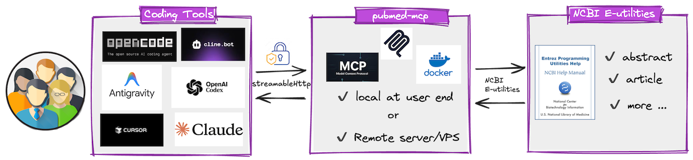

# PubMed MCP Server

PubMed MCP Server built with Python, FastAPI, and FastMCP for searching PubMed papers using NCBI E-utilities.



## Features

- MCP tool `search_pubmed(query, max_results, retstart, sort)` for paper search
- MCP tool `get_pubmed_article(pmid)` for full metadata and abstract
- MCP tool `get_pubmed_abstract(pmid)` for abstract-only retrieval
- Optional Bearer token protection for MCP HTTP endpoint
- Configurable MCP route path and NCBI request rate limit

## Project Structure

- `main.py`: minimal entrypoint only
- `app/server.py`: FastAPI/MCP app assembly and wiring
- `app/tools.py`: MCP tool handlers
- `app/config.py`: environment settings and Bearer auth middleware
- `app/models.py`: response data models
- `app/pubmed_client.py`: PubMed E-utilities client and XML parsing

## Environment Variables

Copy and fill `.env.example` as `.env`:

- `PUBMED_EMAIL`: required by NCBI
- `PUBMED_API_KEY`: optional, improves throughput
- `PUBMED_EUTILS_LIMIT`: requests per second limit (default `10`)
- `MCP_HTTP_PATH`: route where MCP is mounted (default `/pubmed-mcp`)
- `MCP_BEARER_TOKENS`: comma-separated valid Bearer tokens

If `MCP_BEARER_TOKENS` is empty, authentication is disabled.

## Run

```bash
sh deploy-container.sh
```

Health check

```bash
curl http://localhost:8001/health
```

MCP endpoint: `<host>/pubmed-mcp` like `http://127.0.0.1:8001/pubmed-mcp`

## Security Scan

Install all dependencies including dev tools:

```bash
uv sync --dev
```

Run the security scan:

```bash
bash security-scan.sh
```

Artifacts are generated in `security-scan-results/`.

## MCP Configuration

For **OpenCode**

```json
"pubmed-mcp": {
    "type": "remote",
    "url": "http://127.0.0.1:8001/pubmed-mcp",
    "oauth": false,
    "headers": {
        "Authorization": "Bearer your-mcp-token-1"
    }
}
```

For **Cline**:

```json
"pubmed-mcp": {
    "autoApprove": [],
    "disabled": false,
    "timeout": 60,
    "type": "streamableHttp",
    "url": "http://127.0.0.1:8001/pubmed-mcp",
    "headers": {
    "Authorization": "Bearer your-mcp-token-1"
    }
}
```

## Notes

- This server uses NCBI E-utilities API endpoints (`esearch`, `esummary`, `efetch`).
- Keep your `PUBMED_EMAIL` valid and follow NCBI usage guidance: https://www.ncbi.nlm.nih.gov/books/NBK25497/
- Check `E-utilities Quick Start` for NCBI usage guidance: https://www.ncbi.nlm.nih.gov/books/NBK25500/#chapter1.For_More_Information_8
- Check `A General Introduction to the E-utilities` for NCBI usage guidance: https://www.ncbi.nlm.nih.gov/books/NBK25497/

## Security Scan Summary

| Scan | Status |
|---|---|
| Dependency Scan | PASS |
| Static Security Scan | PASS |
| Secret Scan | PASS |
| Container Scan | PASS |
| SBOM | PASS |

[Security Details](/security-scan-results/security_checklist.md)
